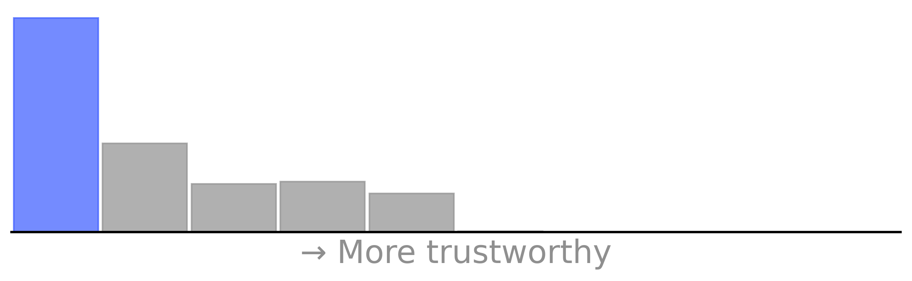
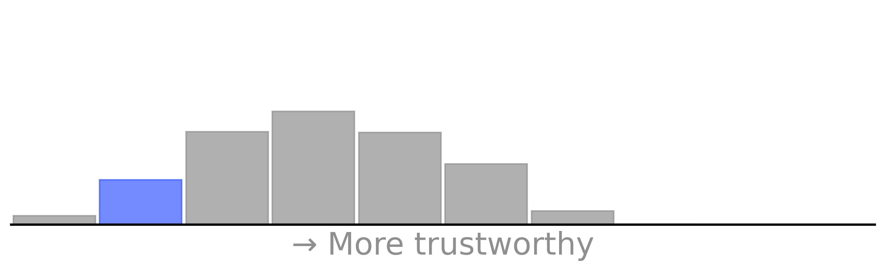

# voice-listener’s Trustee Percentiles

Note: This is a forked repo. The original repo is [here](https://github.com/nithincvpoyyil/voice-listener).
*Data as of January 31, 2024*

<center></center>

-- Above grade is based on the percentile rankings of the 4 repo scores below, which are compared with the top 1000 most-downloaded npm libraries.

<details>
<summary><span style="font-size: 20px;"><strong>Maintenance -- </strong>Beats <strong><span style="color: blue;">11.1%</span></strong> Other Repos</summary>
<div>
<div align=center>
  
</div>
Activity and involvement by this project’s maintainer(s). Maintainers could increase these metrics by extending documentation and being more responsive to community participation (especially issues and PRs).<br><br>
</div>
<table>
  <tr>
    <td>
      <div>
        <strong>Issues Maintenance:</strong> Top 0.0 Percentile
        <p>How efficiently issues are addressed: issues closed and comments on issues.</p>
      </div>
      <div>
        <strong>Community Documentation:</strong> Top 26.8 Percentile
        <p>Support for the community to participate: issue and PR templates, code of conduct, governance, etc.</p>
      </div>
    </td>
    <td>
      <div>
        <strong>Code Maintenance:</strong> Top 0.0 Percentile
        <p>How efficiently code changes are addressed: commits and PRs closed, commit standards.</p>
      </div>
      <div>
        <strong>Maintainer History:</strong> Top 17.5 Percentile
        <p>Maintainer experience: maintainers' other projects.</p>
      </div>
    </td>
  </tr>
</table>
</details>


<details>
<summary><span style="font-size: 20px;"><strong>Contribution -- </strong>Beats <strong><span style="color: blue;">7.6%</span></strong> Other Repos</summary>
<div>
<div align=center>
  
</div>
Activity and involvement by this project’s contributors. Fostering and encouraging more contribution and participation would increase these metrics.<br><br>
</div> 
<table>
  <tr>
    <td>
      <div>
        <strong>Code Contribution:</strong> Top 12.1 Percentile
        <p>Activity to add to the codebase: commits and PRs.</p>
      </div>
      <div>
        <strong>Contributor Participation:</strong> Top 10.7 Percentile
        <p>Activity in discussion and participation: number of contributors, comments made, quality of comments.</p>
      </div>
    </td>
    <td>
      <div>
        <strong>Contributor Growth:</strong> Top 0.0 Percentile
        <p>How the project is scaling in size: change in contributors, PRs.</p>
      </div>
    </td>
  </tr>
</table>
</details>


<details>
<summary><span style="font-size: 20px;"><strong>Popularity -- </strong>Beats <strong><span style="color: blue;">8.8%</span></strong> Other Repos</summary>
<div>
<div align=center>
  
</div>
Activity and usage by this project’s consumers. Spreading this project to more users and maintaining it over time increases these metrics.<br><br>
</div> 
<table>
  <tr>
    <td>
      <div>
        <strong>Stars and Watches:</strong> Top 6.9 Percentile
        <p>How much consumers follow this project: stargazers, watchers.</p>
      </div>
      <div>
        <strong>Forks:</strong> Top 5.6 Percentile
        <p>How much developers fork this project.</p>
      </div>
    </td>
    <td>
      <div>
        <strong>Downstream Dependents:</strong> Top 16.0 Percentile
        <p>For projects producing packages and dependencies, how many downstream projects rely on them.</p>
      </div>
      <div>
        <strong>Project Maturity:</strong> Top 6.7 Percentile
        <p>Size and age of repo: lines of code, creation time, versions.</p>
      </div>
    </td>
  </tr>
</table>
</details>


<details>
<summary><span style="font-size: 20px;"><strong>Code Quality -- </strong>Beats <strong><span style="color: blue;">10.7%</span></strong> Other Repos</summary>
<div>
<div align=center>
  
</div>
Security and review of the project’s code. Contributors can increase these metrics by maintaining the dependencies and setting up automated testing and procedural reviews.<br><br>
</div>  
<table>
  <tr>
    <td>
      <div>
        <strong>Dependencies Health:</strong> Top 31.9 Percentile
        <p>Mitigation of dependency vulnerability risk: dependency versions, reported vulnerabilities.</p>
      </div>
      <div>
        <strong>Review Coverage:</strong> Top 0.2 Percentile
        <p>Scale of manual code reviews: contributors and reviewers per code portion, commit sizes.</p>
      </div>
    </td>
    <td>
      <div>
        <strong>Testing Quality:</strong> Top 0.0 Percentile
        <p>Scale of automated tests: workflow runs, check runs, code authors.</p>
      </div>
    </td>
  </tr>
</table>
</details>


​																				[Metric Details](https://github.com/Elijahzyp/voice-listener_TrustLabel/blob/branch_mcpc/MCPC%20Template%20Metric%20Details.md)


***


# ngx-voiceinput

This is a voice based input plugin for angular2+ framewrok. It was built for modern browsers using TypeScript, CSS3 and HTML5 and Angular >=4.0.0, and Google Chrome is the only browser which supports [web speech API](https://developers.google.com/web/updates/2013/01/Voice-Driven-Web-Apps-Introduction-to-the-Web-Speech-API).

### DEMO : https://nithincvpoyyil.github.io/voicelistner/home

### Installation

`npm install @ngxvoice/ngx-voicelistner` or `yarn add @ngxvoice/ngx-voicelistner`


### Usage


##### App module

```typescript
import { NgxVoiceListnerModule } from "@ngxvoice/ngx-voicelistner";

@NgModule({
  declarations: [
    AppComponent
  ],
  imports: [BrowserModule, NgxVoiceListnerModule],
  bootstrap: [AppComponent]
})
export class AppModule { }

```


##### Example component


```typescript
@Component({
  selector: 'example-component',
  styleUrls: [],
  providers: [],
  template: `<div class="container">
              <voice-listner-input [lang]='en-US' (onListeningVoice)="getTheSearchString($event)" ></voice-listner-input>
             </div>`
})
export class ExampleComponent {

  public voiceStringList: string[] = ['test'];

  constructor() {
  
  }

  public getTheSearchString(finalString: string) {
    console.log('new string - ', finalString);
    this.voiceStringList.push(finalString);
  }
}

```

##### Configuration for language

This library is using 'en-IN' as language config by default, you can chnage this is by adding `lang` input parameter as shown in the example below. For more information, please refer Web Speech API link in the above description.

#### Known issues: If you are facing installtion issues (Error code : EBADPLATFORM or fsevent related issues) [downgrade the npm](https://github.com/npm/npm/issues/8899) to 3.1.0 and try.

```shellscript
npm install -g npm@3.1.0
```

## Credits
`ngx-voiceinput` is based on [ngx-datatable](http://swimlane.github.io/ngx-datatable)'s seed project.

made with :heart:
